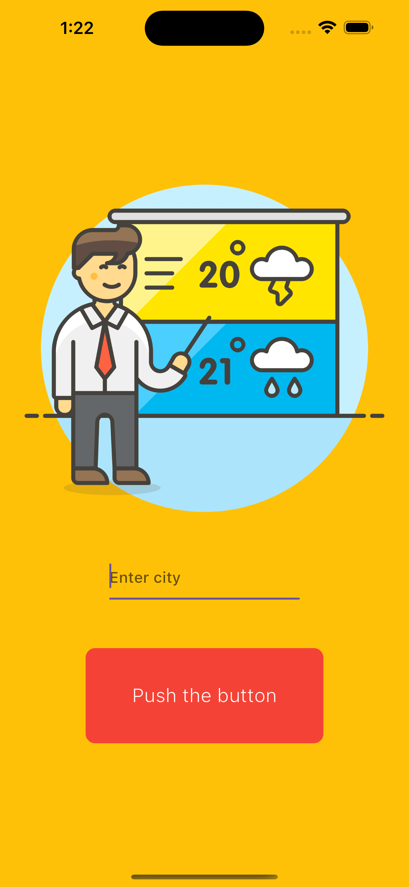
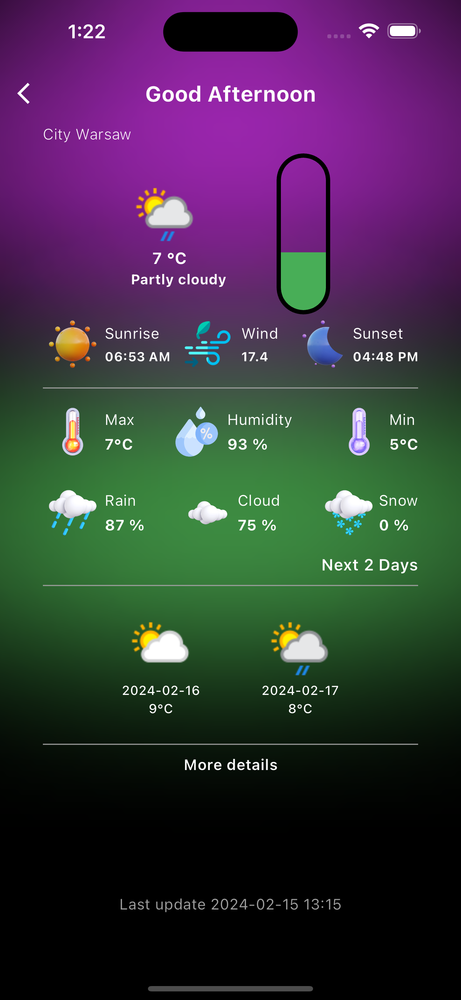

# Weather App Flutter with Bloc

Simple weather application written in Flutter, utilizing the Bloc state management pattern.

## Description

This application allows users to check the current weather as well as the forecast for the upcoming days. It uses an external weather API to fetch weather data.
API: https://www.weatherapi.com

## Features

- Displaying the current weather for a specified city.
- Weather forecast for the upcoming days.
- Weather icons corresponding to the current weather conditions.

## Technologies

- Flutter
- Bloc (BLoC - Business Logic Component)
- HTTP (for communication with the weather API)
- JSON serialization (for data parsing)

## Installation

1. Clone this project to your local repository.
2. Open the project in a development environment such as Android Studio or Visual Studio Code.
3. Run `flutter pub get` in the console to install all dependencies.
4. Configure the API key for the weather service if required.
5. Run the application on a physical device or emulator using `flutter run`.

## Configuration

To configure the application with your own API key:

1. Register on the provider's weather service website (weatherapi.com) and obtain an API key.
2. In the `secrets.dart` file, add your API key as follows:

``
class Secrets {
  static String apiKey() {
    return 'Enter your Api';
  }
}
``

3. Use the `apiKey` variable to make requests to the weather service in the application.

## Screenshots

## Support

If you encounter any issues related to installation or using the application, please contact us, the developers, by raising an issue in the Issues section.

## Author

Jakub Sierocki - [mrkuba1](github.com/mrkuba1) 

## License

This project is licensed under the [MIT License](https://opensource.org/licenses/MIT) - see the [LICENSE](LICENSE) file for details.
